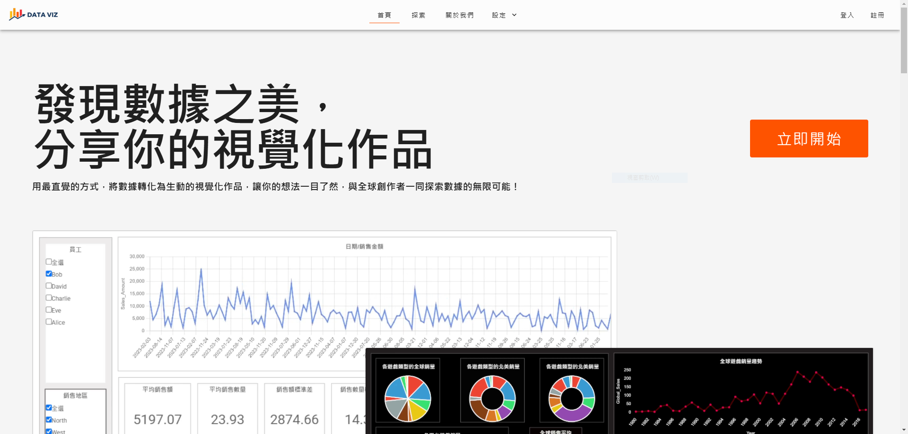
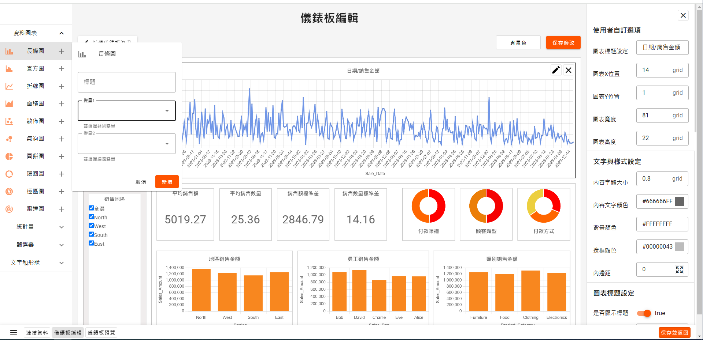

# 📊 DataViz 視覺化資料製作及分享平台

🔗 **簡單易用的數據視覺化製作及分享平台**

[https://hengll.github.io/DataViz](https://hengll.github.io/DataViz)

---

## **📌 目錄**

- [📖 專案介紹](#專案介紹)
- [🚀 功能特色](#功能特色)
- [🛠️ 使用技術](#使用技術)

---

## **📖 專案介紹**

**DataViz** 是一個讓使用者可以輕鬆建立數據視覺化圖表並公開分享的網站。它適合數據分析師、學生、研究人員，甚至是沒有程式背景的使用者來進行數據視覺化。

### **🤔 為什麼需要這個平台？**

- ✅ **降低數據視覺化的門檻**，即使沒有程式背景，也能輕鬆製作圖表
- ✅ **提供數據分享的平台**，讓更多人能交流數據故事
- ✅ **彌補現有工具的不足**，簡化操作流程

---

## **🚀 功能特色**

✔️ **直覺化圖表生成**：上傳數據即可產生折線圖、長條圖、圓餅圖等  
✔️ **互動式視覺化**：透過 Chart.js 提供動態視覺效果  
✔️ **帳號系統**：使用者可以註冊、登入並管理自己的作品  
✔️ **作品分享**：按讚、瀏覽公開圖表  
✔️ **響應式設計**：適用於桌面與手機端

---

## **🛠️ 使用技術**

**前端 (Frontend)**

- Vue.js
- Vuetify
- interact.js(拖拉功能)
- Chart.js(視覺化圖表功能)

**後端 (Backend)**

- node.js(express.js)
- mongoDB(資料庫)

**雲端與部署**

- Cloudinary (圖片 & 圖表縮圖存儲)
- Render (後端部署)
- GitHub Pages (前端部署)
